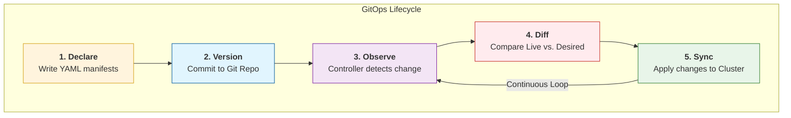
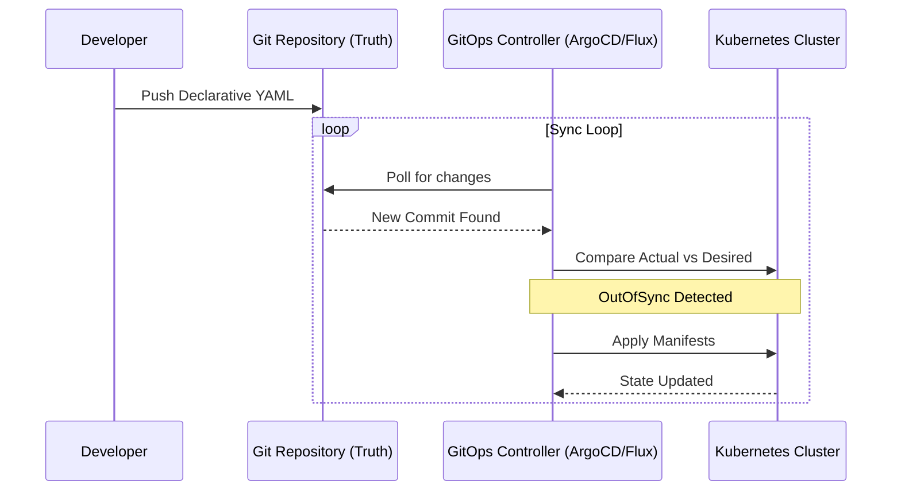

## 🎓 GitOps: The Comprehensive Guide
GitOps is more than just a tool; it is a mental model for operating distributed systems.  
It shifts the operational burden from manual commands to automated state synchronization

### 1.The Core Architecture
In a traditional setup, you "push" changes to a server. In GitOps, the server "pulls" its own configuration.

    

### 2. Step-by-Step Execution Flow
To master GitOps, follow these four logical steps when building your projects:

#### Step A: The Declarative Definition
Everything must be described as code. If you can't define it in a file (YAML, Jsonnet, HCL), it doesn't exist in GitOps.
- Infrastructure: VPCs, Subnets, IAM (via Crossplane or Terraform).
- Apps: Deployments, Services, Ingress.
- Policy: NetworkPolicies, Quotas.
#### Step B: The Single Source of Truth
The Git repository is the only place where human intervention happens.
No kubectl edit: Manual changes are "drift" and will be overwritten.
Audit Trail: Every git commit tells you who changed what and when.

#### Step C: The Feedback Loop (The Controller)
A GitOps agent (like ArgoCD or Flux) runs inside your cluster. It performs two main tasks:
Polling: Checking Git for new commits.
Reconciliation: If Git says "3 replicas" but the cluster has "2," the agent creates the 3rd one automatically.

#### Step D: Drift Detection & Correction
If a developer manually deletes a Pod or changes a ConfigMap using the CLI, 
the Controller detects that the "Actual State" no longer matches the "Desired State" in Git and instantly reverts the change.

### 3. Comparing Workflows

| Feature | Legacy DevOps (Push) | GitOps (Pull) |
| :--- | :--- | :--- |
| **Trigger** | CI Tool (Jenkins/GitHub Actions) | GitOps Controller (Internal) |
| **Permissions** | CI Tool needs Admin access to Cluster | Only Controller needs Admin access |
| **Security** | High risk (Credentials stored in CI) | Low risk (Credentials stay in Cluster) |
| **Drift** | Hard to detect | Automatically corrected |

### 4. Best Practices for Your KB
As you build your projects in this repo, keep these rules in mind:
- Separate Repos: Keep your Application Code (Java/Python) in one repo and your Infrastructure/Manifests in this GitOps repo.
- Pin Versions: Never use :latest tags. Always use specific SHAs or version numbers for Docker images.
- Small Commits: Change one thing at a time so rollbacks are painless.
