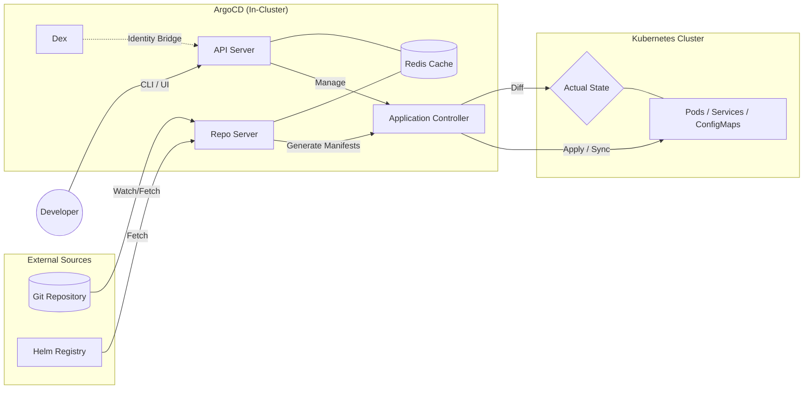
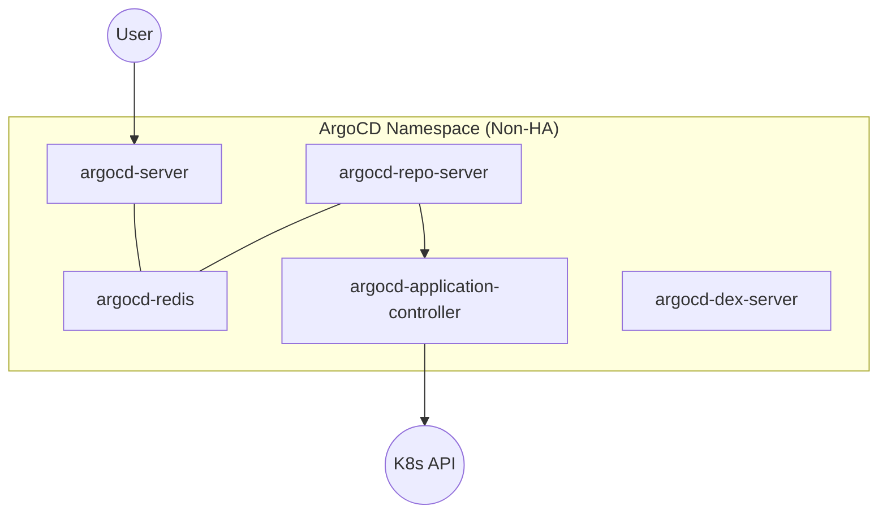
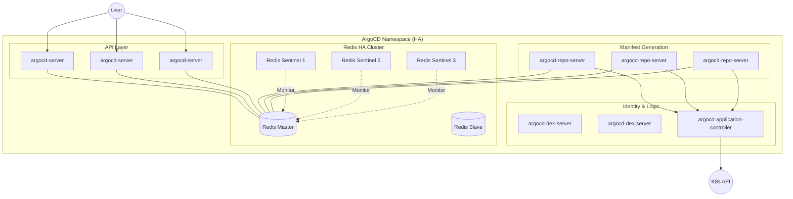

## ArgoCD Architecture 
showing the relationship between the Git Repo, the ArgoCD components, and the Kubernetes Cluster.



### ArgoCD Components
- The API Server: This is the entry point. When you use the ArgoCD UI or CLI, you are talking to this component.
- The Repo Server: This is the "Translator." It takes what's in your shared/ folder and turns it into raw Kubernetes YAML that the cluster understands.
- The Application Controller: This is the "Enforcer." It constantly compares the Repo Server's output with the Live State of the cluster.
- Redis: Keeps things fast. It caches the manifests so ArgoCD doesn't have to ping GitHub every single second.
- Dex: is a pluggable component. If you don't need SSO, you simply don't deploy the argocd-dex-server pod.
#### Access
- Path A (Direct): Used for the initial admin login or if you connect ArgoCD directly to an OIDC provider without using Dex as a shim.
- Path B (SSO): Used when Dex acts as the "translator" between ArgoCD and older or non-OIDC identity providers (like LDAP or SAML).
### HA vs Non-HA Deployment

Non-HA as a "vertical stack" (simple but risky) and HA as a "distributed web" (complex but resilient).

In GitOps, the number of pods isn't just about handling more traffic; it’s about reliability. If your only repo-server pod crashes in a Non-HA setup, your cluster can't sync new changes until it restarts. In HA, the other replicas pick up the slack instantly.
1. Non-HA (Basic/Learning)
In this setup, each component runs as a Single Pod. It is lightweight and perfect for a home lab or a small development cluster.

2. HA (Production Ready)
In the HA version, components are duplicated (Replicas). The most significant change is Redis, which moves from a single pod to a Sentinel Cluster to ensure the cache never goes offline.


#### Key Takeaways for your Documentation:
- State Management: In HA, the redis-ha-proxy (often included) ensures that even if a Redis node fails, the API and Repo servers always find the new Master.
- Performance: The Repo Server is the most common bottleneck. Scaling it to 3 pods (as shown in HA) allows ArgoCD to process multiple Git repositories or large Helm charts in parallel.
- The Controller: You’ll notice only one application-controller is typically shown. While you can scale it (sharding), it operates in a "Leader/Follower" or "Sharded" mode to prevent two pods from trying to update the same resource at the exact same time.

### HA Deployment
To deploy ArgoCD in an HA (High Availability) configuration, you shift away from the simple "all-in-one" manifest and move toward a setup that uses ReplicaSets and Redis Sentinel.
There are two primary ways to deploy the HA version:
#### Method 1: Using the Official HA Manifests (Easiest)
ArgoCD provides a pre-configured manifest specifically for HA. This is the "Advanced" version of the install.yaml you used for the basic setup.
```
# 1. Create the namespace (if not already there)
kubectl create namespace argocd

# 2. Apply the HA-specific manifests
kubectl apply -n argocd -f https://raw.githubusercontent.com/argoproj/argo-cd/stable/manifests/ha/install.yaml
```
What this does differently:
- Sets replicas: 3 for argocd-server and argocd-repo-server.
- Deploys Redis Sentinel (3 nodes) instead of a single Redis pod.
- Configures Pod Anti-Affinity (this ensures the replicas are spread across different worker nodes so that if one node fails, the service stays up).

#### Method 2: Using Helm (Recommended for your Repo)
Since your goal is to be "Advanced," using Helm is the professional way to manage an HA deployment because it allows you to toggle HA features on and off using a values.yaml file.
In your argocd/system/values-ha.yaml, you would define
```
# Example snippet for your values-ha.yaml
global:
  ha:
    enabled: true  # This is the "Magic Switch" in Helm

server:
  replicas: 3
  autoscaling:
    enabled: true
    minReplicas: 3

repoServer:
  replicas: 3

redis:
  enabled: false # Disable standalone redis
redis-ha:
  enabled: true  # Enable Redis Sentinel cluster
```
To deploy via Helm:
```
helm upgrade --install argocd argo/argo-cd \
  -n argocd \
  -f argocd/system/values-ha.yaml
```

🔍 How to Verify the HA Deployment
After running the installation, check your pods. You should see multiple instances of the core services:
```
kubectl get pods -n argocd
```
Expected Output (Truncated):
- argocd-server-xxxxxxxx-abcde (Replica 1)
- argocd-server-xxxxxxxx-fghij (Replica 2)
- argocd-server-xxxxxxxx-klmno (Replica 3)
- argocd-repo-server-xxxxxxxx-12345 (Replica 1)
- argocd-repo-server-xxxxxxxx-67890 (Replica 2)
- argocd-redis-ha-haproxy-xxxxxx (The load balancer for Redis)
- argocd-redis-ha-server-0, 1, 2 (The actual Redis cluster)
⚠️ Important Requirement for HA
For HA to actually provide "High Availability," your Kubernetes cluster must have at least 3 worker nodes. If you deploy the HA configuration on a single-node cluster (like Minikube or a small test VM), all 13+ pods will be crammed onto one machine. If that machine restarts, all replicas go down at once, defeating the purpose of HA.
