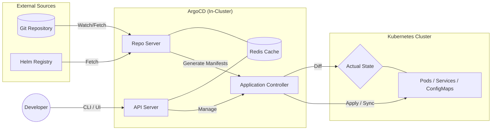

## ArgoCD Architecture 
showing the relationship between the Git Repo, the ArgoCD components, and the Kubernetes Cluster.

### ArgoCD Components
- The API Server: This is the entry point. When you use the ArgoCD UI or CLI, you are talking to this component.
- The Repo Server: This is the "Translator." It takes what's in your shared/ folder and turns it into raw Kubernetes YAML that the cluster understands.
- The Application Controller: This is the "Enforcer." It constantly compares the Repo Server's output with the Live State of the cluster.
- Redis: Keeps things fast. It caches the manifests so ArgoCD doesn't have to ping GitHub every single second.
